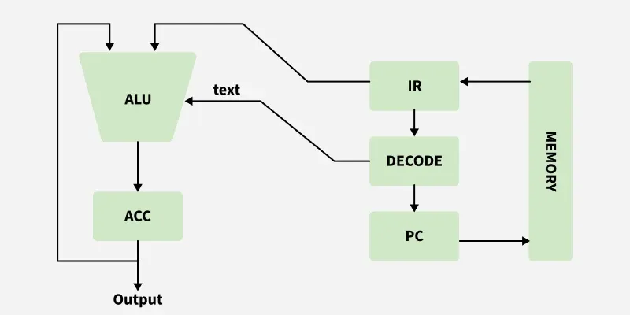

# Single Accumulator-Based CPU Organization

The main points about single accumulator based CPU organisation are:

In this CPU organization, the first ALU operand is always stored in the accumulator and the second operand is present either in registers or in memory.

Accumulator is the default location; after data manipulation the results are stored into the accumulator.

One-address instructions are used in this type of organization.

The instruction format used by this CPU organisation has one address field. Because of this, the CPU is known as a "one-address machine."

## Data Transfer Operation

In this type of operation, data is transferred from a source to a destination.

For example:

LOAD X, STORE Y

Here, `LOAD` is a memory-read operation where data is transferred from memory to the accumulator, and `STORE` is a memory-write operation where data is transferred from the accumulator to memory.

## ALU Operation

In this type of operation, arithmetic operations are performed on the data.

For example:

MULT X

where `X` is the address of the operand. The `MULT` instruction in this example performs the operation:

AC <-- AC * M[X]

`AC` is the accumulator and `M[X]` is the memory word located at address `X`.

This CPU organization was first used in the PDP-8 processor and was common in process control and laboratory applications. It has largely been replaced by general register based CPUs.

## EXAMPLE 
Example

Suppose:

AC = 10

Memory location 500 contains:

20

Instruction:

ADD 500

Meaning:

AC ← AC + M[500]

AC ← 10 + 20

AC ← 30

## Advantages

- One of the operands is always held in the accumulator register, resulting in short instructions and less memory usage.
- Instruction cycle can take less time because it reduces instruction fetching from memory.

## Disadvantages

- When computing complex expressions, program size increases due to the use of many short instructions, which increases memory usage.
- As the number of instructions increases for a program, execution time increases.

