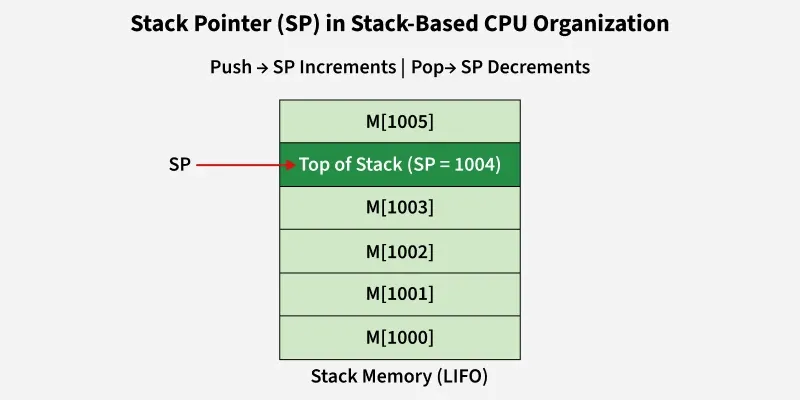

# Stack based CPU Organization

Last Updated :18 Oct, 2025

Stack-based CPU organization represents a minimalist and elegant design that simplifies instruction decoding and naturally supports expression evaluation.
However, this simplicity comes at the cost of reduced flexibility and lower performance for random data access.

* Widely used in virtual machines and recursive computations due to compact instructions and ease of expression handling.
* Less efficient for random memory access and general-purpose computing compared to register-based architectures.

# Stack Pointer (SP)

The Stack Pointer (SP) is a special CPU register that contains the address of the top of the stack.

```text
      TOP
   ┌───────┐
   │ Book 3│ ← SP
   ├───────┤
   │ Book 2│
   ├───────┤
   │ Book 1│
   └───────┘
```

## Full Stack vs Empty Stack

The SP can point to either:

### Full Stack

SP points to the last occupied item.

### Empty Stack

SP points to the next available empty location.


## Stack Operations

Since the stack follows the Last In, First Out (LIFO) principle, the Stack Pointer (SP) is used to keep track of the top element. There are two fundamental operations in a stack-based CPU organization:

* PUSH adds a new operand and increments the SP.
* POP removes the top operand and decrements the SP.


### **PUSH Operation**

The PUSH instruction adds a new operand to the top of the stack. Before placing the operand, the stack pointer is incremented so that it points to the next empty memory location. Then, the data is stored at this location.

**Step-by-step Execution:**

1. Increment SP to point to the next available memory address on the stack.
2. Store the operand at the memory location now pointed to by SP.

**Example Operation:**

> *SP ← SP + 1          // SP = 1000 + 1 = 1001*
>
> *M[SP] ← 25           // M[1001] = 25*

After the PUSH, the stack pointer points to 1001, and the top of the stack holds 25.

### POP Operation

The POP instruction removes the topmost operand from the stack. First, the data at the location pointed to by the SP is transferred to the specified memory location (or register). Then, the SP is decremented to point to the previous element on the stack.

**Step-by-step Execution:**

1. Read the top value from the memory location pointed to by SP.
2. Transfer this value to the desired memory address or register.
3. Decrement SP to move the pointer down to the next available operand.

**Example Operation:**

> *M[2000] ← M[SP]      // M[2000] = M[1001] = 25*
>
> *SP ← SP - 1          // SP = 1001 - 1 = 1000*

After the POP, SP now points back to 1000, effectively removing 25 from the top of the stack.

### **Instruction Format in Stack-Based Organization**

Unlike register-based or accumulator-based architectures, stack-based instructions typically **do not contain an address field**. This is because operands are implicitly taken from the **top two positions of the stack**.

**Example Instruction:**

Zero-address instruction format simplifies instruction decoding and reduces instruction length.

```text
SUB
```

> *X ← M[SP]        // Pop top operand*
>
> *SP ← SP - 1*
>
> *Y ← M[SP]        // Pop next operand*
>
> *SP ← SP - 1*
>
> *Result ← Y - X*
>
> *SP ← SP + 1*
>
> *M[SP] ← Result   // Push result*

## Evaluating Arithmetic Expressions

Stack-based architectures are particularly efficient for evaluating infix expressions converted into postfix (Reverse Polish) notation.

**Expression:**

> *(5 + 3) * (8 - 2)*

**Postfix:**

> *5 3 + 8 2 - **

**Execution Steps:**

| **Step** | **Instruction** | **Stack Content (Top on Right)** |
| -------- | --------------- | -------------------------------- |
| 1        | PUSH 5          | 5                                |
| 2        | PUSH 3          | 5 3                              |
| 3        | ADD             | 8                                |
| 4        | PUSH 8          | 8 8                              |
| 5        | PUSH 2          | 8 8 2                            |
| 6        | SUB             | 8 6                              |
| 7        | MUL             | 48                               |
